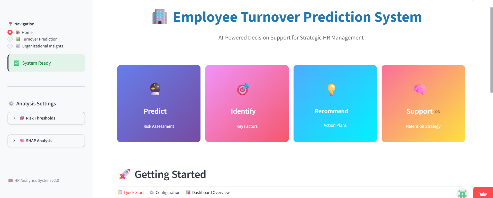
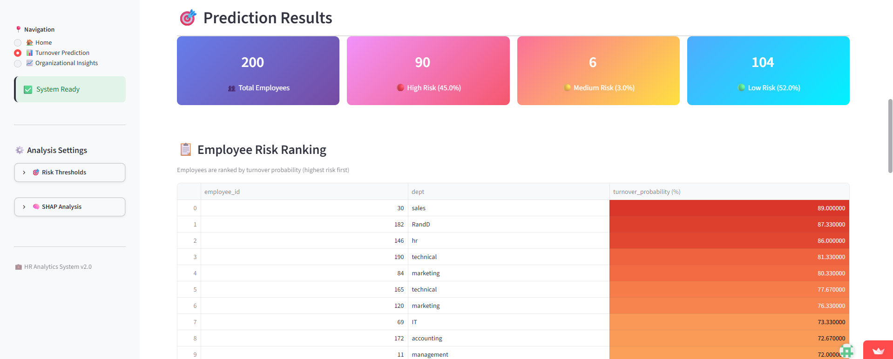
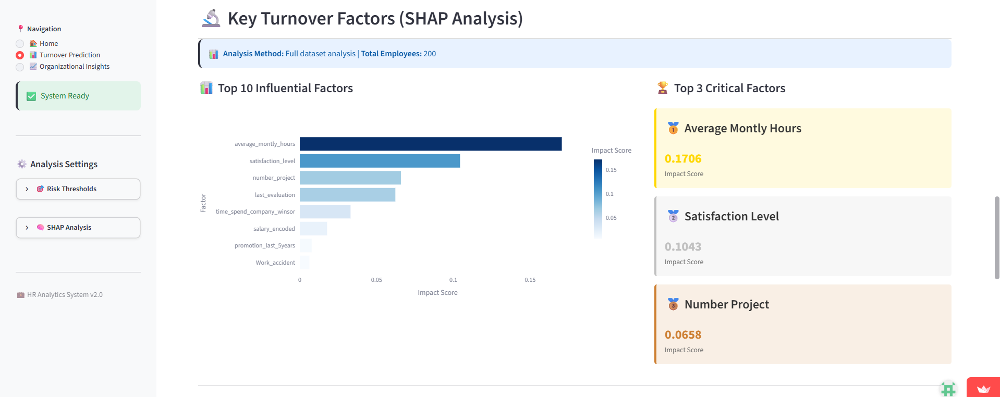
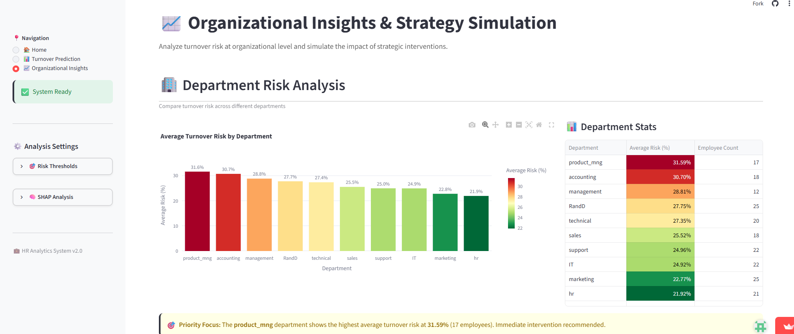

# Employee Turnover Prediction System

An AI-powered decision support system designed for Strategic HR Management to predict individual and organizational employee turnover risk using Random Forest classification and explainable AI (SHAP Analysis).

## Project Description
This project is an interactive web-based dashboard application built with **Streamlit**. It processes employee metrics to determine their turnover probabilities and groups them into specific risk levels (High, Medium, Low). It leverages a robust machine learning backend alongside automated preprocessing (Winsorization, Ordinal Encoding), hyperparameter-optimized model pipelines, and local interpretability mechanisms to pinpoint specific driving factors behind employee attrition. The primary audience includes Human Resource Executives and Organizational Strategists attempting to formulate preventative retention methodologies.

## Dataset
The model works dynamically with data formatted closely with classic HR metrics. It accepts a historical file (`historical_hr.csv`) for underlying optimizations and lets users upload generic inference data.
*   **Feature Columns & Aliases Recognition:** The application handles flexible naming variants:
    *   `satisfaction_level` (aliases: satisfaction, satisfaction_score, kepuasan) — Scale 0 to 1
    *   `last_evaluation` (aliases: evaluation, eval_score, last_eval) — Scale 0 to 1
    *   `number_project` (aliases: projects, num_projects, project_count, jumlah_proyek) — Discrete
    *   `average_montly_hours` (aliases: monthly_hours, avg_hours, jam_kerja) — Continuous
    *   `time_spend_company` (aliases: tenure, years, masa_kerja) — Discrete
    *   `work_accident` (aliases: accident, kecelakaan) — Binary (0/1)
    *   `promotion_last_5years` (aliases: promotion, promosi, promoted) — Binary (0/1)
    *   `salary` (aliases: gaji, compensation) — Categorical string (`low`, `medium`, `high`)
*   **Target Label (for training):** `left` (aliases: turnover, attrition, keluar) — Binary (0/1)
*   **Metadata Fields:** `employee_id`, `name`, `dept` (Department-level comparisons).

## Method & Workflow
1.  **Column Normalization:** Maps inconsistent inputs into standard features using a pre-defined multi-alias structural lookup.
2.  **Duplicate Dropping:** Removes duplicated records natively during data ingested pipelines.
3.  **Winsorization:** Mitigates the skewing effect of outliers inside `time_spend_company` via IQR calculations.
4.  **Ordinal Encoding:** Converts categorical variables like `salary` to standard monotonic codes (`low: 1`, `medium: 2`, `high: 3`).
5.  **Smart Sampling (SHAP Execution):** Employs stratified sampling centered around individual predicted probabilities for handling highly dense sets (>1000 records) effectively without computational overhead.
6.  **Simulation Engine:** Features an arbitrary "What-If" intervention architecture altering user-selected feature variables globally (`add`, `set`, or `scale`) to recalculate probability trends.

## Model
*   **Algorithm:** Random Forest Classifier (`sklearn.ensemble.RandomForestClassifier`)
*   **Hyperparameters Specified:** 
    *   `n_estimators=300`
    *   `random_state=42`
    *   `n_jobs=-1` (Full-core multi-processing)
*   **Threshold Mechanics:** Automatically evaluates the optimal classification boundary via **Youden's Index** extracted from the ROC Curve ($TPR - FPR$), helping map custom high/medium risk distributions.

## Result
*   Generates an individualized risk matrix mapping localized features against total probability.
*   Extracts Top 10 Influential Factors via raw absolute average tree SHAP contributions.
*   Aggregates departmental performance tracking to isolate structurally weak areas.
*   Provides granular predictive outputs before and after applying synthetic management policy adjustments.

## How to Run
### Prerequisites
Ensure you have Python 3.8+ installed along with the required workspace modules:
```
pip install streamlit pandas numpy scikit-learn shap plotly joblib
```

### Directory Structure
Set up your directory tree structure as follows:
```
.
├── app.py                  # The main application code provided
├── data/
│   └── historical_hr.csv   # Required for automated base training
└── model/                  # Generated automatically upon startup
    ├── rf_model.pkl
    └── feature_list.json
```

### Execution
Launch the Streamlit dashboard server with:
```
streamlit run app.py
```

## Screenshots




*   **Dashboard Home & Guide:** Overview panels, current metric boundaries, configurations.
*   **Turnover Matrix & Ranking:** Dataframes styled with sequential heatmaps ranking high-risk individuals.
*   **SHAP Analysis Charts:** Horizontal bar visualization showing local contribution values.
*   **Department Overviews:** Aggregate dynamic charts pinpointing structural issues.

## Demo
* Demo Link: `https://projekakhirdss-on94h8yhpjz7p4hbpd3qtq.streamlit.app/`

## 👥 Developed By
| Nama | NPM |
| :--- | :--- |
|Fadhila Latsa Tsabita|140810230005|
|Siti Aisyah Nurdyanti| 140810230015 |
|Nada Ghaisani Hasyim|140810230052|
